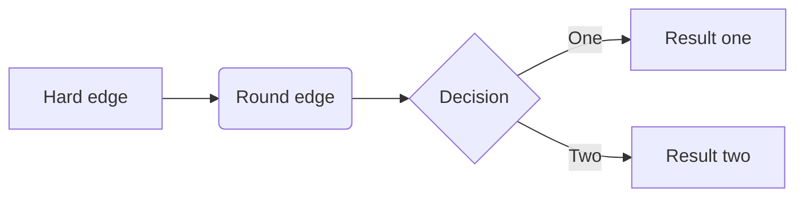

# RC for KuckyCopter

## [Hardware](/docs/development/hardware.md)
## [Software](/docs/development/software.md)
## [Resources](/docs/development/recources.md)
## [Abstract](/docs/development/abstract.md)


|tab|col1|
|---|----|
|a  | 1  |

| vbxb |  cvbc |   | cvbcv | cvb |   |
|------|:-----:|---|-------|-----|---|
| 1    | **a** |   |       |     |   |
| 2    | **b** |   |       |     |   |
| 3    | **c** |   |       |     |   |

jkfdjddjfj

```cpp
#include "std.io"
void main(){

}
```



## Links
https://youtu.be/JBvnB0279-Q?si=LplhdbVDn-7sKslk

```cpp
#include <test>
#define dfgdfg

void main(){

}

```
