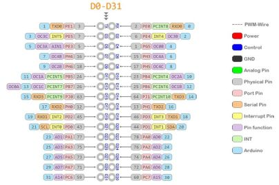
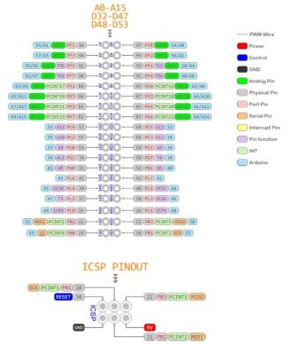
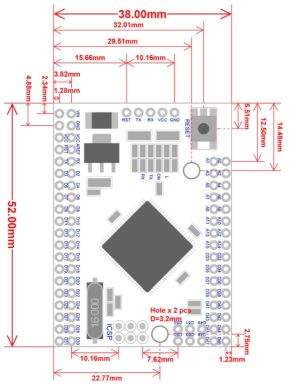
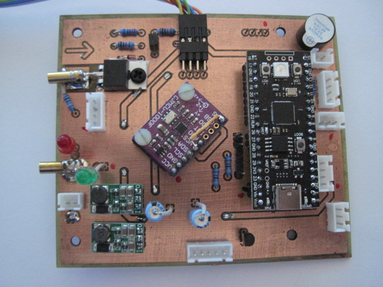
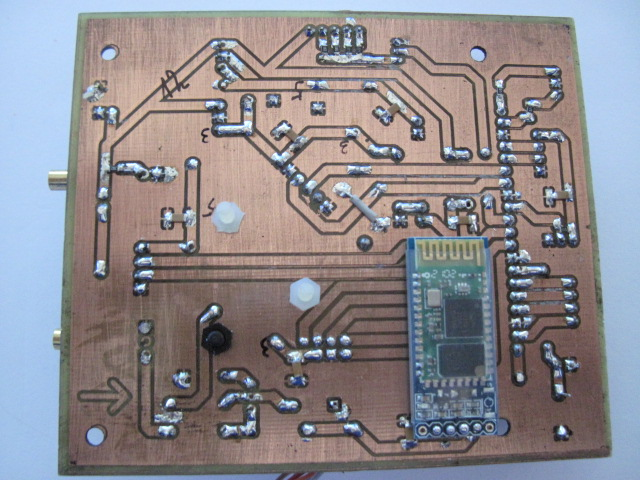
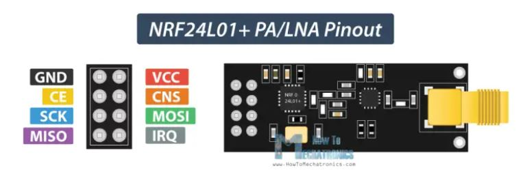
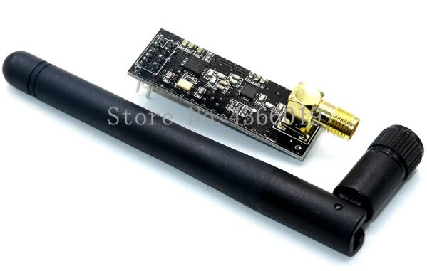

# Hardware
## Controller
MEGA2560 PRO Arduino kompatibles Mega 2560 Pro Board

• ATmega2560-16AU 
• 256 KB Flash 
• 8 KB SRAM 
• 4 KB EEPROM 
• 54x Digital I/O 
• 15x PWM Output 
• 16x Analog Input 
• 5 V über microUSB 
• 7 - 9 V über Vin 
• 5 V Logik-Level 
• 800 mA Ausgangsstrom 
• 16 MHz Frequenz 
• MicroUSB zu UART 
• Maße (LxB): 55 x 38 mm

## PinOut
 
  
   

## Circut Board

## Radio
**NRF24**

Spezifikationen:
Frequenz: 2,4 GHz ~ 2,5 GHz
Betriebs spannung: 3 ~ 3,6 V Max
Strom: 115mA
Multi-frequenz: 125 frequenz
Reichweite bis 1100m
Unterstützung bis zu sechs kanäle von daten empfang

|Funkt.|Pin |D|Color|Stripe|
|------|----|----|-----|------|
| MISO | 21 | 16 |     |   1  | 
| CSN  | 22 | 17 |     |   2  |
| SLK  | 24 | 18 |     |   3  |
| MOSI | 25 | 19 |     |   4  |
| CE   | 26 | 20 |     |   5  |
| 3V3  |    |    | Red |      |
| GND  |    |    |Black|      |

## Alarm
**aktiver Summer kontinuierlicher Piepton 12*9,5mm 5V**

|Funkt. |Pin |D|
|-------|----|----|
| Alarm |  |  |